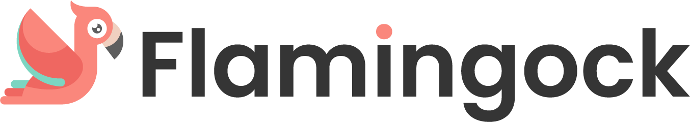

___ 

**Flamingock** is the evolution of Mongock, designed as a cloud-native solution for managing versioning, and auditing changes in systems that evolve alongside your application.

Whilst Mongock focused on versioning NoSQL databases, Flamingock extends this concept to all technologies, systems, and configurations, with built-in auditing and rollback capabilities.
It ensures the application and its dependent components evolve together by managing configuration changes during startup to maintain version compatibility, streamline integration, and reduce conflicts at deployment time.

Flamingock also introduces new mechanisms for defining changes in an extensible and customizable manner, beyond traditional code-based methods.

> Additionally, Flamingock offers multiple infrastructure setups for providing flexibility to users, as it introduces a Cloud offering whilst still retaining existing supported databases such as MongoDB, DynamoDB, or Couchbase.

## 🔑 Key Features
- 🔄 **Auditing & Rollback**: Comprehensive auditing capabilities with support for rollback of changes to ensure consistency and control.

- ☁️ **Cloud-Native**: Optimized for cloud environments, providing scalability, flexibility, and high availability.

- 🔗 **Extended System Support**: Expands on Mongock's support to all systems, technologies and configurations.

- 🚀 **Seamless Deployment**: Deploy your application and systems together, ensuring version compatibility and reducing deployment friction.

- 🧩 **Flexible Migration Templates**: Define migrations using YAML templates, providing a code-free option for managing changes.

- ⚡ **GraalVM Support**: Enables the compilation of Java applications into native executables for improved performance.

- 👥 **Multi-Tenant Support**: Designed to handle multiple tenants within the same infrastructure.

## 📂 Getting started with our examples  
For full examples of how to use Flamingock in various environments, check the [examples project](https://github.com/mongock/flamingock-examples).

## 🔀 Migration from Mongock
If you're transitioning from Mongock to Flamingock, we have separate migration guides for each use case:

- **[Standalone Applications](MONGOCK_STANDALONE_MIGRATION.md)**: Detailed instructions for migrating from Mongock to Flamingock in a standalone Java application.
- **[Spring Boot Applications](MONGOCK_SPRINGBOOT_MIGRATION.md)**: Step-by-step guide for migrating from Mongock to Flamingock in a Spring Boot application.

Each guide provides specific instructions tailored to the corresponding environment. Follow the appropriate guide to ensure a smooth migration process.

## 📢 Contributing
We welcome contributions! If you have an idea for a new example or improvement to an existing one, feel free to submit a pull request. Check out our [CONTRIBUTING.md](CONTRIBUTING.md) for guidelines.

## 🤝 Get Involved
⭐ Star the [Flamingock repository](https://github.com/mongock/flamingock-project) to show your support!

🐞 Report issues or suggest features in the [Flamingock issue tracker](https://github.com/mongock/flamingock-project/issues).

💬 Join the discussion in the [Flamingock community](https://github.com/mongock/flamingock-project/discussions).

## 📜 License
This repository is licensed under the [Apache License 2.0](LICENSE.md).

## 🔥 Explore, experiment, and empower your projects with Flamingock!
Let us know what you think or where you’d like to see Flamingock used next.

