# Flamingock Project - Architecture Overview

**Document Version**: 1.0  
**Date**: 2025-01-06  
**Audience**: Development Team  

## Executive Summary

This document provides a comprehensive overview of the Flamingock project's module architecture, dependencies, and structure. It includes visual representations, module classifications, and dependency relationships to help the development team understand the project's organization and make informed decisions about future development.

## Module Classification

### 🔵 IBU (Import By User) - Libraries
These modules are designed to be directly imported by end users:

#### Community Edition
- `flamingock-ce-mongodb-sync` - MongoDB Sync driver integration
- `flamingock-ce-dynamodb` - DynamoDB integration  
- `flamingock-ce-couchbase` - Couchbase integration
- `flamingock-ce-mongodb-springdata` - Spring Data MongoDB v4.x integration
- `flamingock-ce-mongodb-springdata-v3-legacy` - Spring Data MongoDB v3.x integration

#### Templates
- `flamingock-mongodb-sync-template` - MongoDB template support
- `flamingock-sql-template` - SQL template support

#### Transactioners  
- `mongodb-sync-transactioner` - MongoDB transaction management
- `dynamodb-transactioner` - DynamoDB transaction management
- `sql-transactioner` - SQL transaction management

#### Platform Integration
- `flamingock-springboot-integration` - Spring Boot v3.x integration
- `flamingock-springboot-integration-v2-legacy` - Spring Boot v2.x integration

#### Core Extensions
- `flamingock-processor` - Annotation processor
- `flamingock-graalvm` - GraalVM native image support
- `flamingock-cloud` - Cloud edition

#### BOMs
- `flamingock-cloud-bom` - Cloud dependencies management

### 🟣 UBU (Used By User) - API Access Only
These modules provide APIs that users interact with but typically don't import directly:

- `flamingock-ce-commons` - Community edition common APIs
- `flamingock-core-api` - Core framework APIs and annotations

### 🟠 Internal Modules
These modules are implementation details not exposed to end users:

- `flamingock-core` - Core framework implementation
- `flamingock-core-commons` - Core common components
- `flamingock-importer` - Migration tooling from other frameworks
- All utility modules (`general-util`, `mongodb-util`, `dynamodb-util`, `test-util`)

## Architecture Diagram

```mermaid
graph TB
    %% Define module categories with colors
    classDef ibu fill:#e1f5fe,stroke:#01579b,stroke-width:3px
    classDef ubu fill:#f3e5f5,stroke:#4a148c,stroke-width:3px
    classDef internal fill:#fff3e0,stroke:#e65100,stroke-width:2px
    classDef util fill:#e8f5e8,stroke:#2e7d32,stroke-width:2px
    classDef bom fill:#fce4ec,stroke:#880e4f,stroke-width:2px

    %% CORE MODULES
    subgraph Core["🏗️ Core Framework"]
        direction TB
        flamingock-core-api[flamingock-core-api<br/>📚 UBU]:::ubu
        flamingock-core-commons[flamingock-core-commons<br/>🔧 Internal]:::internal
        flamingock-core[flamingock-core<br/>⚙️ Internal]:::internal
        flamingock-processor[flamingock-processor<br/>🔄 IBU]:::ibu
        flamingock-graalvm[flamingock-graalvm<br/>🚀 IBU]:::ibu
        flamingock-importer[flamingock-importer<br/>🔄 Internal]:::internal
    end

    %% UTILS
    subgraph Utils["🛠️ Utilities"]
        direction TB
        general-util[general-util<br/>🔧 Internal]:::util
        test-util[test-util<br/>🧪 Internal]:::util
        mongodb-util[mongodb-util<br/>🍃 Internal]:::util
        dynamodb-util[dynamodb-util<br/>☁️ Internal]:::util
    end

    %% CLOUD
    subgraph Cloud["☁️ Cloud Edition"]
        direction TB
        flamingock-cloud[flamingock-cloud<br/>☁️ IBU]:::ibu
        flamingock-cloud-bom[flamingock-cloud-bom<br/>📦 IBU]:::bom
    end

    %% COMMUNITY
    subgraph Community["🌍 Community Edition"]
        direction TB
        flamingock-ce-commons[flamingock-ce-commons<br/>📚 UBU]:::ubu
        flamingock-ce-mongodb-sync[flamingock-ce-mongodb-sync<br/>🍃 IBU]:::ibu
        flamingock-ce-dynamodb[flamingock-ce-dynamodb<br/>☁️ IBU]:::ibu
        flamingock-ce-couchbase[flamingock-ce-couchbase<br/>🗄️ IBU]:::ibu
        flamingock-ce-mongodb-springdata[flamingock-ce-mongodb-springdata<br/>🍃🌱 IBU]:::ibu
        flamingock-ce-mongodb-springdata-v3-legacy[flamingock-ce-mongodb-springdata-v3-legacy<br/>🍃🌱📱 IBU]:::ibu
        flamingock-ce-bom[flamingock-ce-bom<br/>📦 BOM]:::bom
    end

    %% TRANSACTIONERS
    subgraph Transactioners["🔄 Transaction Managers"]
        direction TB
        mongodb-sync-transactioner[mongodb-sync-transactioner<br/>🍃🔄 IBU]:::ibu
        dynamodb-transactioner[dynamodb-transactioner<br/>☁️🔄 IBU]:::ibu
        sql-transactioner[sql-transactioner<br/>🗃️🔄 IBU]:::ibu
    end

    %% TEMPLATES
    subgraph Templates["📝 Templates"]
        direction TB
        flamingock-mongodb-sync-template[flamingock-mongodb-sync-template<br/>🍃📝 IBU]:::ibu
        flamingock-sql-template[flamingock-sql-template<br/>🗃️📝 IBU]:::ibu
    end

    %% PLATFORM PLUGINS
    subgraph Platforms["🔌 Platform Integration"]
        direction TB
        flamingock-springboot-integration[flamingock-springboot-integration<br/>🌱 IBU]:::ibu
        flamingock-springboot-integration-v2-legacy[flamingock-springboot-integration-v2-legacy<br/>🌱📱 IBU]:::ibu
    end

    %% CORE DEPENDENCIES (api = thick line, implementation = normal line)
    flamingock-core-commons -->|api| general-util
    flamingock-core-commons -->|api| flamingock-core-api
    flamingock-core-api -->|impl| general-util
    flamingock-core -->|api| flamingock-core-commons
    flamingock-core -->|api| flamingock-processor
    flamingock-core -->|api| flamingock-importer
    flamingock-core -->|api| general-util
    flamingock-processor -->|api| flamingock-core-commons
    flamingock-processor -->|api| general-util
    flamingock-graalvm -->|api| flamingock-core
    flamingock-importer -->|impl| flamingock-core-commons

    %% CLOUD DEPENDENCIES
    flamingock-cloud -->|impl| flamingock-core

    %% COMMUNITY DEPENDENCIES
    flamingock-ce-commons -->|impl| flamingock-core
    flamingock-ce-commons -->|api| flamingock-core-api
    flamingock-ce-mongodb-sync -->|impl| mongodb-util
    flamingock-ce-mongodb-sync -->|impl| flamingock-core
    flamingock-ce-mongodb-sync -->|api| mongodb-sync-transactioner
    flamingock-ce-mongodb-sync -->|api| flamingock-ce-commons
    flamingock-ce-dynamodb -->|impl| dynamodb-util
    flamingock-ce-dynamodb -->|impl| flamingock-core
    flamingock-ce-dynamodb -->|api| flamingock-ce-commons
    flamingock-ce-dynamodb -->|api| dynamodb-transactioner
    flamingock-ce-couchbase -->|impl| flamingock-core
    flamingock-ce-couchbase -->|api| flamingock-ce-commons
    flamingock-ce-mongodb-springdata -->|impl| mongodb-util
    flamingock-ce-mongodb-springdata -->|impl| flamingock-core
    flamingock-ce-mongodb-springdata -->|api| flamingock-ce-mongodb-sync

    %% TRANSACTIONER DEPENDENCIES
    mongodb-sync-transactioner -->|api| flamingock-core
    mongodb-sync-transactioner -->|impl| mongodb-util
    dynamodb-transactioner -->|impl| dynamodb-util
    dynamodb-transactioner -->|api| flamingock-core

    %% TEMPLATE DEPENDENCIES
    flamingock-mongodb-sync-template -->|impl| flamingock-core-commons

    %% PLATFORM DEPENDENCIES
    flamingock-springboot-integration -->|api| flamingock-core
    flamingock-springboot-integration -->|impl| flamingock-core-commons

    %% UTIL DEPENDENCIES
    mongodb-util --> general-util
    dynamodb-util --> general-util
    test-util --> general-util
    test-util --> flamingock-core
    test-util --> flamingock-core-commons

    %% External Dependencies Legend
    subgraph ExtDeps["🌐 Key External Dependencies"]
        direction LR
        Jackson[Jackson 2.16.0<br/>JSON Processing]
        MongoDB[MongoDB Driver<br/>3.7.0-6.0.0]
        Spring[Spring Framework<br/>6.0.0-7.0.0]
        AWS[AWS SDK<br/>DynamoDB Enhanced]
        Couchbase[Couchbase Client<br/>3.0.0-4.0.0]
    end

    %% External dependency connections (dotted lines)
    flamingock-core-api -.->|impl| Jackson
    general-util -.->|api| Jackson
    flamingock-ce-mongodb-sync -.->|compileOnly| MongoDB
    flamingock-springboot-integration -.->|compileOnly| Spring
    flamingock-ce-dynamodb -.->|compileOnly| AWS
    flamingock-ce-couchbase -.->|compileOnly| Couchbase
```

## Dependency Types Legend

- **`api`** (thick arrows): Dependencies exposed in the module's public API
- **`implementation`** (normal arrows): Internal dependencies not exposed to consumers
- **`compileOnly`** (dotted arrows): Dependencies required at compile time but not bundled

## Java Compatibility Matrix

| Module | Java Version | Target Users |
|--------|--------------|--------------|
| **Core Framework** | Java 8+ | All |
| `flamingock-graalvm` | Java 17+ | GraalVM users |
| `flamingock-springboot-integration` | Java 17+ | Spring Boot 3.x users |
| `flamingock-ce-mongodb-springdata` | Java 17+ | Spring Data 4.x users |
| **All Other Modules** | Java 8+ | Broad compatibility |

## Key Architecture Principles

### 1. **Clear Separation of Concerns**
- **Core**: Framework implementation and APIs
- **Community**: Database-specific implementations
- **Cloud**: SaaS/managed service implementation
- **Platform**: Framework integrations (Spring Boot, etc.)
- **Utils**: Shared utilities and helpers

### 2. **Dependency Management**
- Database drivers use `compileOnly` to avoid version lock-in
- Public APIs properly exposed via `api` dependencies
- Internal implementations hidden via `implementation` dependencies

### 3. **User Experience**
- **IBU modules**: Direct imports for end users
- **UBU modules**: API access without direct import
- **Internal modules**: Implementation details hidden from users

## Module Relationships Summary

### Core Dependencies
- Everything flows through `flamingock-core` and `flamingock-core-commons`
- `flamingock-core-api` provides stable APIs for users
- Utilities provide shared functionality

### Community Edition Flow
- `flamingock-ce-commons` serves as the base for all CE modules
- Database-specific modules integrate their respective drivers
- Transactioners handle transaction management per database type

### Platform Integration
- Spring Boot integration provides auto-configuration
- Templates provide no-code/low-code solutions
- Processor enables compile-time code generation

