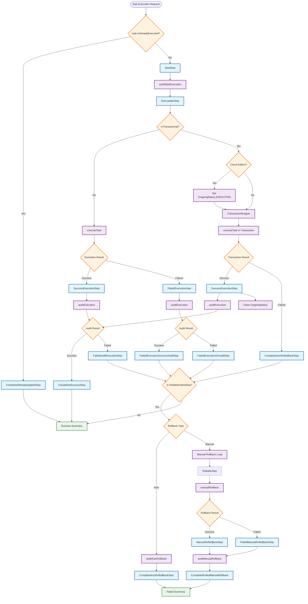

# Flamingock Task Step Navigation Flow

## Task Execution Flow Diagram

The following Mermaid graph shows how tasks flow through different TaskStep types during execution in the StepNavigator:

## Key Components Explanation

### Entry Point Logic
- **All task execution starts** with checking `task.isAlreadyExecuted()`
- **No alternative entry points** - failed tasks that continue still go through StartStep
- **Pre-execution filtering** determines which tasks reach the StepNavigator

### Step Transitions
1. **StartStep** → **ExecutableStep** (via `start()` method)
2. **ExecutableStep** → **ExecutionStep** variants (via `execute()`)
3. **ExecutionStep** → **AfterExecutionAuditStep** variants (via `applyAuditResult()`)

### Transaction Handling
- **Transactional tasks** go through `TransactionWrapper`
- **Cloud edition** tracks ongoing status during execution
- **Auto-rollback** occurs for transactional failures
- **Manual rollback** handles non-transactional failures

### Rollback Mechanisms
- **RollableFailedStep** triggers rollback process
- **Manual rollback** loops through rollback steps
- **Auto rollback** for transaction-managed failures
- **Audit operations** track all rollback activities

### Completion States
- **CompletedSuccessStep**: Successful execution and audit
- **CompletedAlreadyAppliedStep**: Task was already executed
- **CompletedFailedManualRollback**: Failed with manual rollback
- **CompleteAutoRolledBackStep**: Failed with automatic rollback

## Critical Insights

1. **Single Entry Path**: Despite the complexity, all executions flow through StartStep
2. **State-Based Navigation**: Step transitions are based on execution outcomes and audit results  
3. **Transaction Awareness**: Cloud and Community editions handle transactions differently
4. **Comprehensive Rollback**: Multiple rollback strategies ensure system consistency
5. **Audit Trail**: Every step transition is audited for complete traceability

This navigation system ensures robust execution with proper error handling, rollback capabilities, and complete audit trails for all change operations.